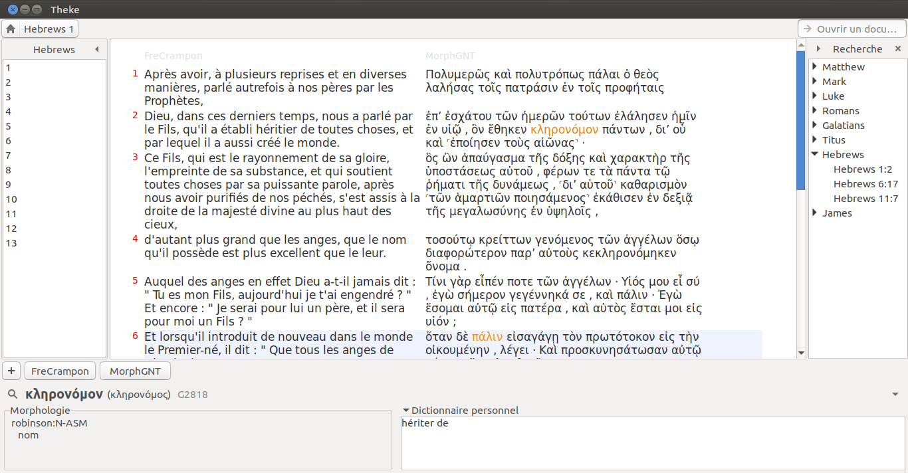

# theke
*Lire et étudier la Bible et l'enseignement de l'Église.*

## Participer au développement de Theke

Voici quelques indications qui vous permettront de télécharger Theke et de l'utiliser à partir de son code source. De cette manière, vous pourrez le bidouiller et participer à son développement.

L'installation se fait en 3 temps.

1. [15 min] Installer la librairie Sword.
2. [5 min] Télécharger le code source de Theke.
3. [10 min] Mettre en place l'environnement virtuel python.

Comptez une petite demi-heure pour suivre toutes ces étapes.

**Convention.** `PROJECTS` est le dossier de base à partir duquel nous allons travailler. Il n'est pas nécessairement vide. Il peut déjà contenir d'autres fichiers, d'autres projets.

### 1. Installer la librairie Sword.

Installez les utilitaires et les libraires nécessaires à la compilation de Sword.

* `sudo apt install subversion build-essential autotools-dev pkg-config libz-dev libclucene-dev libicu-dev libcurl4-gnutls-dev libtool m4 automake cmake swig`

Créez dans `PROJECTS` un dossier de travail et télécharger le code source de Sword.

* `mkdir sword && cd sword`
* `svn co http://crosswire.org/svn/sword/trunk sources`

Compilez et installez Sword.

* `mkdir build && cd build`
* `cmake -DLIBSWORD_LIBRARY_TYPE="Shared" -DCMAKE_INSTALL_PREFIX="/usr" -DSWORD_PYTHON_3:BOOL=TRUE ../sources`
* `make -j4`
* `sudo make install`

### 2. Télécharger le code source de Theke.

Depuis le dossier `PROJECTS`, téléchargez le code source de Theke.

* `cd PROJECTS`
* `git clone https://github.com/a2ohm/theke.git`

### 3. Mettre en place l'environnement virtuel python.

Pour faire fonctionner Theke, vous devez installer plusieurs librairies python. Pour qu'elles n'interfèrent pas avec le reste de votre système, nous allons mettre en place un environnement virtuel python.

Si besoin, installez `python3-venv`.

* `sudo apt install python3-venv`

Dans le dossier contenant le code source de Theke, créez l'environnement virtuel et basculez dedans.

* `cd theke`
* `python3 -m venv .venv`
* `source .venv/bin/activate`

**Remarque.** En fonction de votre shell, peut-être devrez-vous utiliser `source .venv/bin/activate.csh` ou `source .venv/bin/activate.fish`.

Pour indiquer que vous êtes maintenant dans l'environnement virtuel, vous devez lire `(.venv)` devant l'invite de commande de votre terminal.

**Remarque.** Pour sortir de l'environnement virtuel, il suffit de lancer la commande `deactivate`.

Mettez à jour les paquets de base.

* `pip3 install --update pip`
* `pip3 install --update setuptools`

#### PyGObject

Installez PyGObject.

(source : [https://pygobject.readthedocs.io/en/latest/getting_started.html](https://pygobject.readthedocs.io/en/latest/getting_started.html#ubuntu-logo-ubuntu-debian-logo-debian) )

* `sudo apt install libgirepository1.0-dev gcc libcairo2-dev pkg-config python3-dev gir1.2-gtk-3.0 `
* `pip3 install pycairo`
* `pip3 install PyGObject`

#### Autres librairies

Installez les autres librairies requises : BeautifulSoup4, Jinja2, PyYaml.

* `pip3 install beautifulsoup4`
* `pip3 install Jinja2`
* `pip3 install pyyaml`

#### Sword

Installez le paquet Sword que vous avez compilé tout à l'heure.

* `cd  ../sword/build/bindings/swig/python3/`
* `python setup.py install`

#### Theke
Et voilà ! Pour lancer Theke, **revenez dans le répertoire du projet** et exécutez la commande suivante.

* `cd PROJECTS/theke`
* `python3 theke.py`

## Utilisation

### Dépôts Sword

Theke ne sait pas encore télécharger et installer les modules Sword. Il faut passer par un logiciel tiers pour le faire (ex. [Xiphos](https://xiphos.org/)). Vous trouverez les informations nécessaires dans la page d'aide de Theke.

**Modules d'intérêts.**

Nom du module | Nom du dépôt | Description
------------- | ------------ | -----------
OSHB | CrossWire > Texte bibliques > ﬠברית מקראית | Open Scriptures Hebrew Bible
EarlyFathers | Xiphos > Livres > English | -
MorphGNT | CrossWire > Textes bibliques > Κοινὴ Ἑλληνική | Morphologically Parsed Greek New Testament based on the SBLGNT
2TGreek | Xiphos > Textes bibliques > Κοινὴ Ἑλληνική | Morphologically Parsed Greek Old and New Testament

### Theke

Pour lancer Theke, exécuter la commande suivante depuis le répertoire du projet.

* `python3 theke.py`
